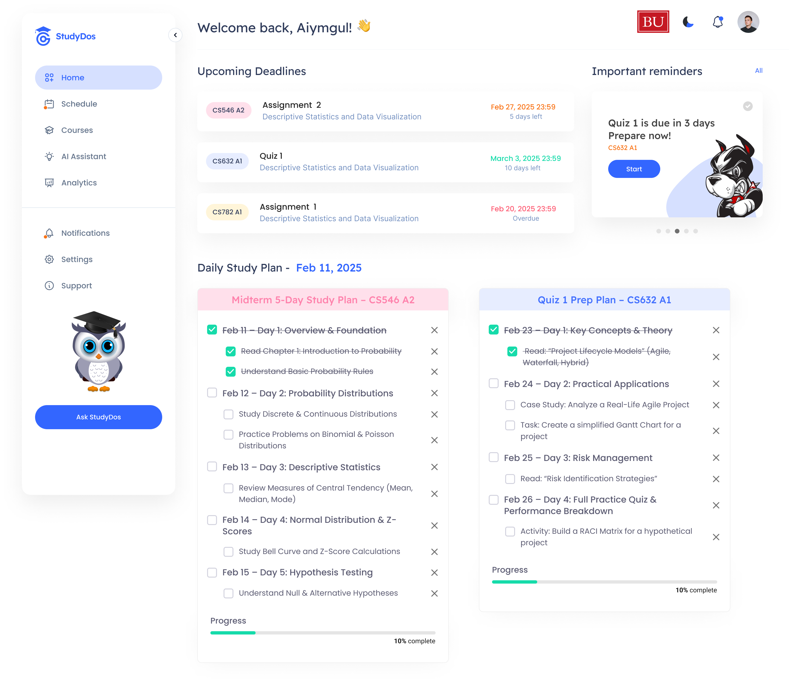

# StudyDos Project

**StudyDos** is a full-stack application designed to help students use AI responsibly, preserving their critical thinking skills while providing valuable hints to achieve academic goals. The frontend is built with **React.js**, and the backend is powered by **Express.js**, while the database is managed using **MongoDB Atlas** with **AWS**. The application also integrates an **AI-powered LLM module** developed with **Python 3.8+** and **pip**, utilizing an **OpenAI API key**. The platform is designed to prevent over-reliance on AI by offering suggestions instead of direct answers, ensuring students remain engaged in the learning process. In the future, StudyDos will integrate with school systems, enabling access to educational materials and further refining the LLM by training it on school databases.

## Figma Prototype

Explore the [StudyDos UI Figma Prototype](https://www.figma.com/proto/SHTmZnace3LfyiFJSJJyuE/StudyDos?page-id=1%3A2&node-id=1-145&viewport=-7147%2C127%2C0.5&scaling=scale-down-width&content-scaling=fixed&starting-point-node-id=1%3A145&embed-host=share).

> **Note:** GitHub README files do not support iframes. Click the link or the image below to view the prototype in your browser.

[](https://www.figma.com/proto/SHTmZnace3LfyiFJSJJyuE/StudyDos?page-id=1%3A2&node-id=1-145&viewport=-7147%2C127%2C0.5&scaling=scale-down-width&content-scaling=fixed&starting-point-node-id=1%3A145&embed-host=share)


## 📌 Project Structure
```
StudyDos/
│── backend/        # Backend (Node.js, Express)
│── frontend/       # Frontend (React, Vue, or Angular)
│── fastapi/        # LLM API (FastAPI, Flask)
│── docker-compose.yml
│── .gitmodules
│── README.md
```

## 🚀 Getting Started

### 1️⃣ LLM (FastAPI) Setup
```bash
# Navigate to the fastapi folder
cd fastapi

# Create a virtual environment
python -m venv env

# Activate the virtual environment
# On Windows:
env\Scripts\activate
# On Unix or MacOS:
source env/bin/activate

# Install dependencies
pip install -r requirements.txt

# Create a .env file with your OpenAI API key
echo "OPENAI_API_KEY=your_openai_api_key_here" > .env

# Run the FastAPI server
uvicorn main:app --reload
```

### 2️⃣ Backend (Express.js) Setup
```bash
# Navigate to the backend folder
cd backend

# Install dependencies
npm install express
npm install mongoose
npm install dotenv
npm install cors
npm install axios

# Create a .env file in the backend folder
# Add the following environment variables
# MONGO_URI=your_mongodb_connection_string
# PORT=your_desired_port

# Create a .gitignore file and exclude environment-sensitive files
echo "node_modules\n.env" > .gitignore

# Start the backend server
node src/server.js
```

### 3️⃣ Frontend (React) Setup
```bash
# Navigate to the frontend folder
cd frontend

# Install dependencies
npm install

# Start the development server
npm run dev
```

## 🛠️ Running the Full Project
To run all components together, open three terminal windows and run each setup in its respective folder. Once everything is up and running, you can access the frontend in your browser and interact with the backend and LLM service.

---

### 🎯 Notes
- Ensure you have **Node.js**, **npm**, and **Python** installed before running the setup.
- The `.env` files should not be committed to version control.
- If using `git submodule` for `fastapi`, initialize it with:
  ```bash
  git submodule update --init --recursive
  ```
